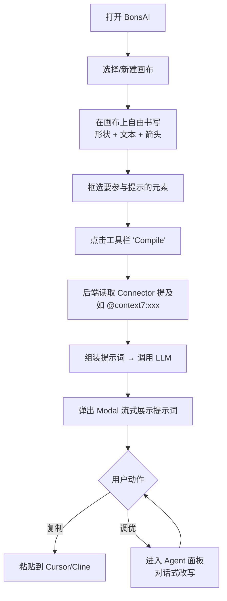

# 00 · 产品定位与架构总览

## 一、定位重塑

| 维度 | 重构前 | 重构后 |
|---|---|---|
| 形态 | 自然语言 → Excalidraw 图表一次性生成器 | 结构化提示词工程白板 |
| 核心价值 | 帮用户画图 | 帮 Coding Agent 得到最优提示词 |
| 用户动作 | 输入描述 → 等待 → 看到图 | 在画布上组织想法 → 框选 → 拿到"上下文完备"的提示词 |
| AI 输出物 | 一堆图元 | 一段**适合 AI Agent 直接消费**的提示词（带可选 Connector 注入） |
| 持久化 | 无（仅内存） | 多画布持久化（SQLite） |
| 工作流核心 | AI 绘画 | AI **改写 + 调优** 提示词 |

定位关键词：**白板 + 编译 + Agent**。画布是输入，提示词是输出，Agent 面板是协作改造车间。

## 二、用户视角的核心流程



## 三、架构总览

```
┌───────────────────────────────────────────────────────────────┐
│  Browser (React 19 + Next 16)                                 │
│                                                               │
│  ┌──────────────────────┐      ┌──────────────────────────┐   │
│  │  ExcalidrawWrapper   │      │  Right Panel (Agent)     │   │
│  │  ┌────────────────┐  │      │  ┌────────────────────┐  │   │
│  │  │ Excalidraw 0.18│  │      │  │ AgentPanel         │  │   │
│  │  │ + selection    │  │      │  │ - 聊天列表          │  │   │
│  │  │   tracking     │  │      │  │ - 工具调用轨迹      │  │   │
│  │  └────────────────┘  │      │  │ - 输入框 + 发送    │  │   │
│  │  ┌────────────────┐  │      │  └────────────────────┘  │   │
│  │  │ BoardSwitcher  │  │      └──────────────────────────┘   │
│  │  └────────────────┘  │                                    │
│  │  ┌────────────────┐  │      ┌──────────────────────────┐   │
│  │  │ SelectionToolbar│ │      │  PromptModal             │   │
│  │  └────────────────┘  │      │  - 流式展示提示词         │   │
│  └──────────────────────┘      │  - 复制 / 调优            │   │
│                                └──────────────────────────┘   │
└───────────────────────────────────────────────────────────────┘
                │ fetch                          │
                ▼                                ▼
┌───────────────────────────────────────────────────────────────┐
│  Next.js Route Handlers (src/app/api)                         │
│                                                               │
│  /api/boards       ────────► SQLite (boards)                  │
│  /api/boards/[id]  ────────► snapshot PATCH                  │
│  /api/compile      ────────► SSE → LLM (OpenAI-compat)       │
│  /api/agent        ────────► SSE → LLM + 工具调用              │
│  /api/agent/[tool] ────────► Connector 注入（模块 3 留口）      │
└───────────────────────────────────────────────────────────────┘
                │
                ▼
┌───────────────────────────────────────────────────────────────┐
│  Drizzle ORM + better-sqlite3                                 │
│  data/bonsai.db                                                │
│  table: boards (id, name, snapshot_json, created_at, ...)      │
└───────────────────────────────────────────────────────────────┘
```

## 四、技术栈与版本

- 框架：Next.js 16 + React 19
- 画布：@excalidraw/excalidraw 0.18
- 数据库：better-sqlite3 + drizzle-orm + drizzle-kit
- UI：Tailwind 4 + Radix UI primitives + lucide-react
- LLM：openai SDK（兼容 OpenAI-compatible provider）
- 校验：zod 4
- 状态：React `useState` + `useReducer`（不上 Redux/Zustand）

## 五、模块边界

| 模块 | 入口 | 数据归属 | 阻塞 |
|---|---|---|---|
| 1 画布 + 持久化 | `/` 页面 | boards.snapshot | 无 |
| 2 Compile | 选区工具栏 → Modal | 无（输入实时） | 依赖 1 |
| 3 Connector | /api/agent/[tool] | connector_cache（未来） | 留接口 |
| 4 Agent 面板 | 右侧抽屉 | localStorage per board | 依赖 1 |
| 5 Refine / 清理 | — | — | 留待后续 |

## 六、关键设计原则

1. **渐进改造**：保留 Excalidraw 渲染层，原 AI 绘图功能降级到 `/legacy`，至少 2 个版本
2. **服务端单源**：画布的 `snapshot_json` 是真理来源；前端只做乐观更新
3. **Connector 中性**：模块 2 不强依赖模块 3，模块 3 是 `/api/agent` 之上的横切层
4. **可逆决策**：所有 tab/组件尽量独立，便于回滚
5. **响应式退化**：无 JS 时 `/legacy` 至少能渲染提示文字 `/api/test-connection`

## 七、风险一览

| 风险 | 等级 | 缓解 |
|---|---|---|
| 选区提取质量差导致提示词差 | 中 | 提取规则迭代 + 提供"编辑选中文本"入口 |
| SQLite 并发写 | 低 | 写作串行（write lock）+ snapshot 每 2s 防抖 |
| LLM 流式中断 | 中 | SSE 自动重连 + 弹窗保留已接收内容 |
| 原 AI 绘图用户工作流破坏 | 中 | 保留 `/legacy` 路由 |
