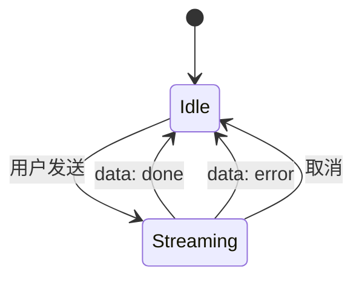

# 04 · 模块 4：Agent 聊天面板重写

## 目标

把现有"AI 一次性绘图"的聊天面板，改造为"AI 对当前提示词进行对话式调优"的 Agent 面板。
保持 UI 整体外观延续原设计的整洁感，重写底层交互与 API。

## 不做什么

- ❌ 不实现多会话/折叠/搜索（单线性会话）
- ❌ 不实现语音/TTS
- ❌ 不修改原 `@excalidraw/excalidraw` 渲染层

## 关键差异（与原 /api/chat）

| 维度 | 原聊天 | 新 Agent |
|---|---|---|
| 入口 | 顶部标题 / 输入框提示 "描述图表" | 当前提示词卡 (Current Prompt) |
| 上下文 | 当前画布全部元素 | 当前提示词 + 选区文本 + 历史消息 |
| 输出物 | Excalidraw 元素 JSON | **改写后的提示词文本** + 可选工具调用 |
| 模型返回 | tool_call 强制 | 文本为主 + 工具可选 |
| 持久化 | 仅内存 | localStorage per board |

## 工具集（v1）

```
1. regenerate_preset   - 用另一种风格/语气重写整段提示词
2. apply_refine         - 对当前提示词做精炼（合并/去重/补全）
3. add_connector        - 占位：仅在提示词中标注 '@context7:xxx' 位置（模块 3 后续接管）
```

工具以 zod schema 定义，服务端在 SSE 中以 `tool_call` 事件触发；前端按 `tool_name` 分发处理。

## 数据结构

```ts
type AgentMessage =
  | { id: string; role: "user";     content: string; ts: number }
  | { id: string; role: "assistant";content: string; ts: number; toolCalls?: ToolCallRecord[] };

type ToolCallRecord = {
  id: string;
  name: "regenerate_preset" | "apply_refine" | "add_connector";
  args: unknown;       // zod 校验后的对象
  result?: unknown;    // 服务端执行后的结果摘要
  ts: number;
};
```

## HTTP 接口：`POST /api/agent`

### Request

```jsonc
{
  "boardId": "b_abc123",
  "messages": [
    { "role": "user", "content": "帮我更面向 TypeScript 资深开发者" }
  ],
  "currentPrompt": "现在需要在 Next.js 中实现...",
  "currentSelection": "阅读顺序: 认证模块; 流程: 用户→DB",
  "config": { "apiKey": "...", "baseUrl": "...", "model": "gpt-4o-mini", "temperature": 0.4 }
}
```

### Response（SSE 帧）

```
data: {"type":"text","delta":"正在"}
data: {"type":"text","delta":"调整"}
data: {"type":"tool_call","name":"apply_refine","args":{...}}
data: {"type":"tool_result","name":"apply_refine","result":{"saved":true}}
data: {"type":"text","delta":" 已完成"}
data: {"type":"done","messages":[{...},{...}]}
```

错误：
```
data: {"type":"error","error":"..."}
```

## 前端组件

### `<AgentPanel />`

分段：
1. **Current Prompt**（可折叠）：顶部卡片展示当前选区编译出的提示词，若无则提示"先在画布上框选元素并点击 Compile"
2. **Message List**：用户气泡左对齐 / 助手气泡右对齐；工具调用卡片 inline
3. **Quick Actions**（用于无输入直接调工具）："🔁 重新生成" / "✂️ 精简" / "🌐 加 Connector"
4. **Input**：底部 textarea，Cmd/Ctrl+Enter 发送

### 状态机



按 boardId 在 `localStorage["bonsai:agent-history:<boardId>"]` 落盘最近 50 条消息，刷新后回填。

## 系统提示词要点

```text
你是 BonsAI 的提示词调优助手。

用户已经在画布上圈出一组想法，并生成了"当前提示词"。
请你基于用户的指令去改写"当前提示词"，输出**改写后的完整文本**，而不是只描述改动。
保持 mention（@context7:xxx 等）原样存在。
当用户说"精简/合并/补充某部分"时，使用 apply_refine 工具。
当用户要求不同语气/风格时，使用 regenerate_preset 工具。
当用户提到阅读外部资料时，使用 add_connector 占位工具。
不要修改"当前提示词"以外的领域假设。
```

## 文件清单

```
src/lib/agent/
  tools.ts             zod schema + 服务端代理 dispatch
  prompts.ts           系统提示词
  streaming.ts         与模块 2 共享的 SSE 解析
  history.ts           localStorage 落盘与回填
src/app/api/agent/
  route.ts             POST，组装 messages，调用 openai SDK
src/components/
  AgentPanel.tsx       主要组件
  ToolCallChip.tsx     工具调用 bubble
```

## 文件删除

- `src/app/api/chat/route.ts` 删除（迁移为 agent）
- `src/lib/element-generator.ts` 保留（本版不再引用）

## 关键决策

1. **不引入 LangGraph / Mastra**：直接 openai SDK + zod schema，足矣
2. **localStorage 而非 SQLite 存历史**：历史不上服务端，避免引入用户态；后续可加 `/api/agent/history`
3. **工具以纯文本协议暴露**：避免与 OpenAI 协议耦合，方便后续切 Anthropic / 自研
4. **承接模块 2 的 Modal 入口**：PromptModal 的 "在 Agent 中调优" 把 currentPrompt 推入 AgentPanel

## 验收

- [ ] 框选 → Compile → Modal → "在 Agent 中调优" → AgentPanel 顶部出现 Current Prompt
- [ ] 输入 "让它更 Pythonic"，助手气泡流式输出修改后的完整提示词
- [ ] 刷新页面后，对话历史可回放
- [ ] 切换 board 后 AgentPanel history 也跟着切
- [ ] 工具调用（apply_refine）能正确出现在气泡中
- [ ] 异常时显示错误且不破坏现有对话
