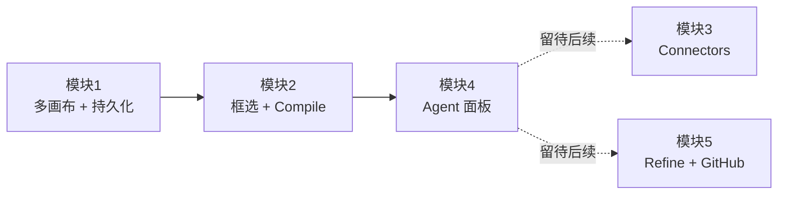

# BonsAI · 开发文档

> 本目录是 `next-ai-excalidraw` 项目重构到 BonsAI 形态的开发文档集合。

## 文档导航

| 文件 | 内容 | 状态 |
|---|---|---|
| [`00-overview.md`](./00-overview.md) | 产品定位 + 架构总览 | ✅ 草案 v0.1 |
| [`01-canvas-boards.md`](./01-canvas-boards.md) | 模块 1：多画布 + 服务端持久化 | ✅ 草案 v0.1 |
| [`02-compile-core.md`](./02-compile-core.md) | 模块 2：框选提取 + Compile 核心流程 | ✅ 草案 v0.1 |
| [`03-connectors.md`](./03-connectors.md) | 模块 3：Connector 系统（占位 + 接口预留） | ⏳ 占位 |
| [`04-agent-panel.md`](./04-agent-panel.md) | 模块 4：Agent 聊天面板重写 | ✅ 草案 v0.1 |
| [`05-refine-github-cleanup.md`](./05-refine-github-cleanup.md) | 模块 5：Refine + GitHub + 清理（占位） | ⏳ 占位 |
| [`06-conventions.md`](./06-conventions.md) | 项目编码约定（命名/错误/CSS/提交） | ✅ 草案 v0.1 |

## 版本与状态

- 文档版本：v0.1 (草案)
- 适用代码版本：基于重构前的 `next-ai-excalidraw` 0.1.0
- 本次实施范围：模块 1、模块 2、模块 4（不含 Connector 第一批与模块 5）

## 模块执行顺序

每个模块结束后停下汇报，全部完成后再做全量 `npm run lint` / `npm run build` 检查。
